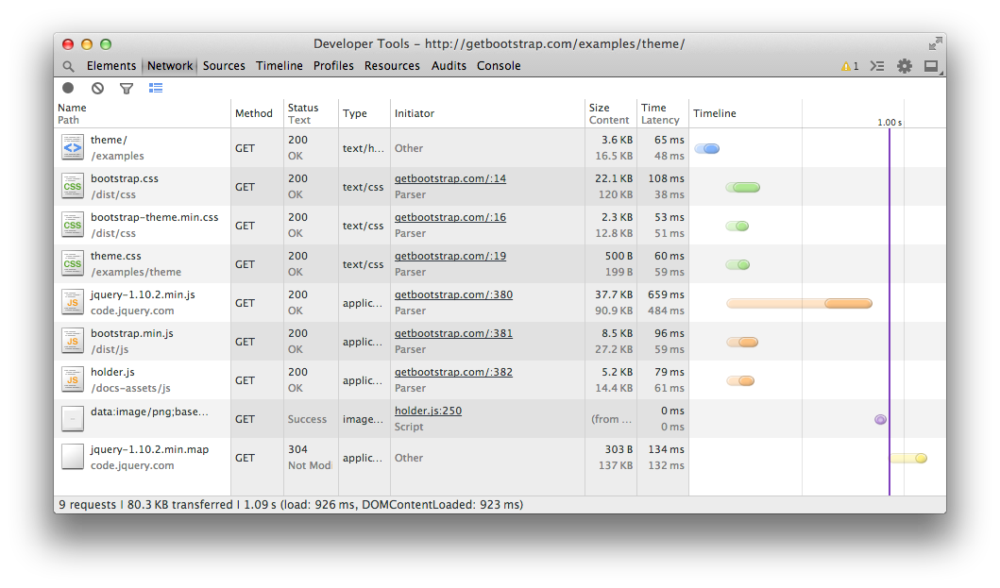

#  aptible-bootstrap-theme

A Bootstrap theme based on our main website, https://www.aptible.com.

### Template  
In the template folder, there is a base template from http://getbootstrap.com/  

a. Like the template, this theme uses:  

- Bootstrap v3.0.3  
- Holder.js v2.2  
- jQuery v1.10.2  

These are the bare minimum files you need. For example, if you're doing a static site, it makes sesnse to just [hit a CDN for them](http://www.bootstrapcdn.com/).

b. If want to use more current versions of these dependencies, be sure to remember that this theme was built on these versions when you debug.

c. The `theme.css` file is implementing a practice recommended [for fixing the navbar to the top of the page](http://getbootstrap.com/components/#navbar-fixed-top).

d. The links in the original `getbootstrap.html` were all absolute to http://getbootstrap.com. This template has relative links so you can explore it locally when you pull down this repo. 

### Production
In the Aptible theme, I have kept them pointing to http://getbootstrap.com for performance reasons. The getbootstrap domain points to the [twbs GitHub Pages site](https://github.com/twbs/), which looks like it is behind a CDN:

You might swap the jQuery source to [MaxCDN or something](https://oss.maxcdn.com/libs/jquery/1.9.1/jquery.js), but they don't have 1.10.2, so buyer beware.
